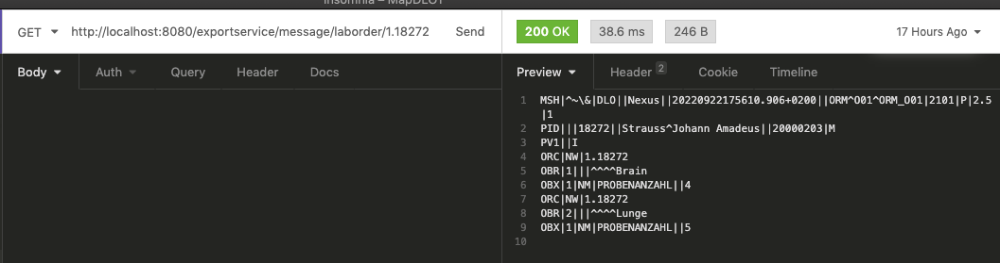

## About The Project

<div>    
  
</div>

### Built With

* Quarkus
* HAPI
* Docker
* Wiremock
* Maven
  ```

### Installation

1. Up mockup services
   ```
   docker-compose -f src/main/docker/wiremock.yml up
   ```
2. debug ExportService
   ```
    mvn quarkus:dev
   ```


## Usage

Invoke a GET Request to following endpoint for Map one laborder

```
http://localhost:8080/exportservice/message/laborder/0a90221a-7cca-107e-817c-cb711f93029d
   ```

   ```
http://localhost:8080/exportservice/message/laborder/0a9047b6-8291-10fb-8183-6441556c1b36
   ```


<div>    
  
</div>

Invoke a GET Request to following endpoint for see mock data

```
http://localhost:8080/exportservice/laborder/mock/0a9047b6-8291-10fb-8183-6441556c1b36
```


